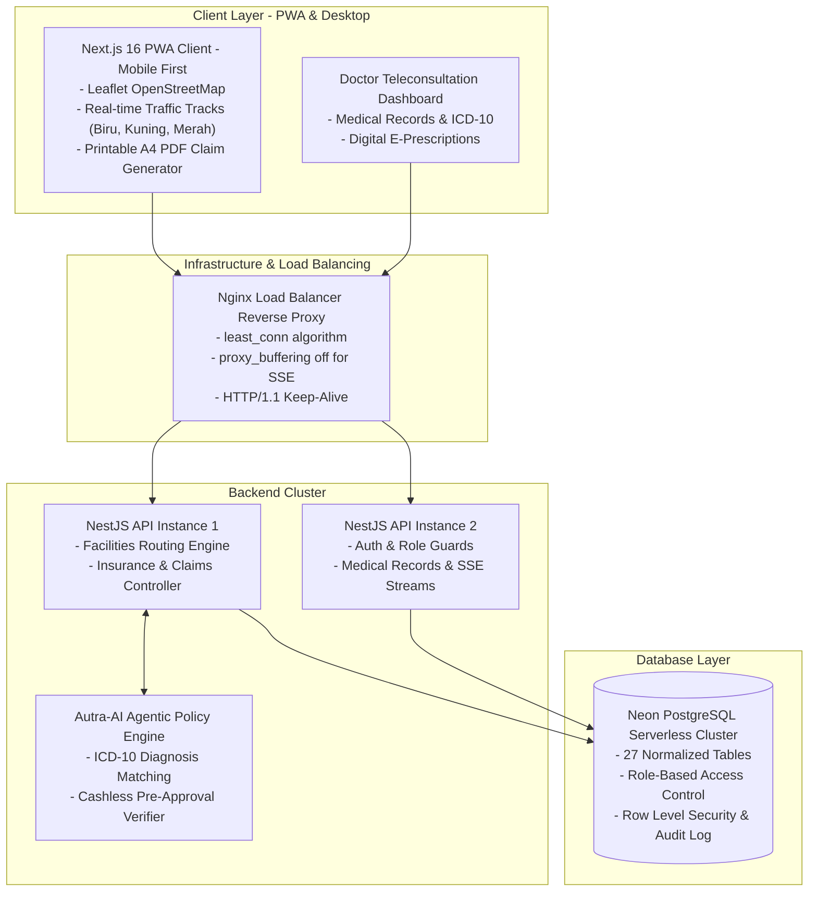
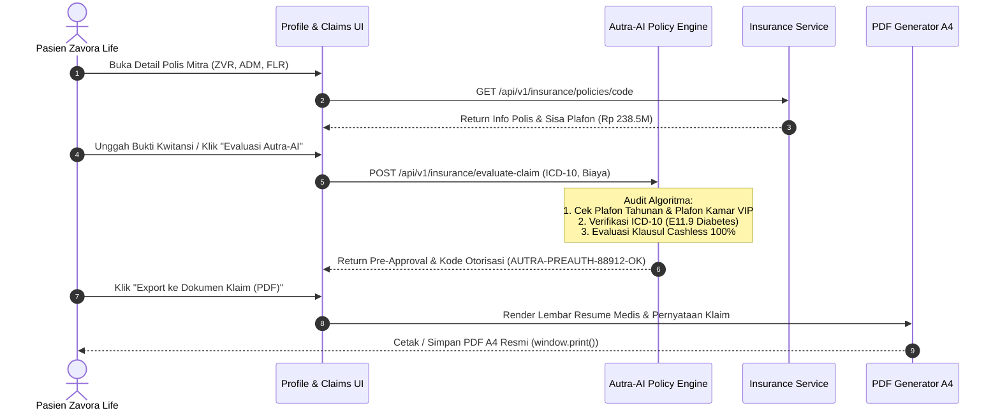
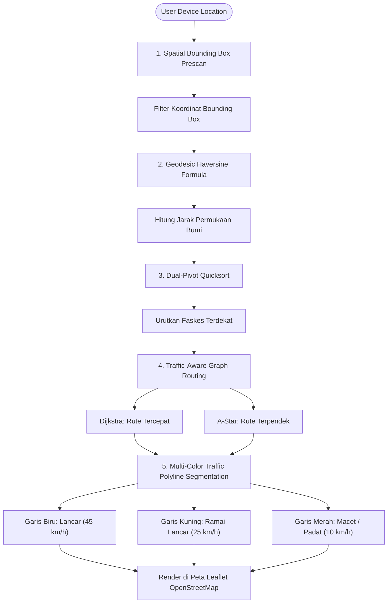
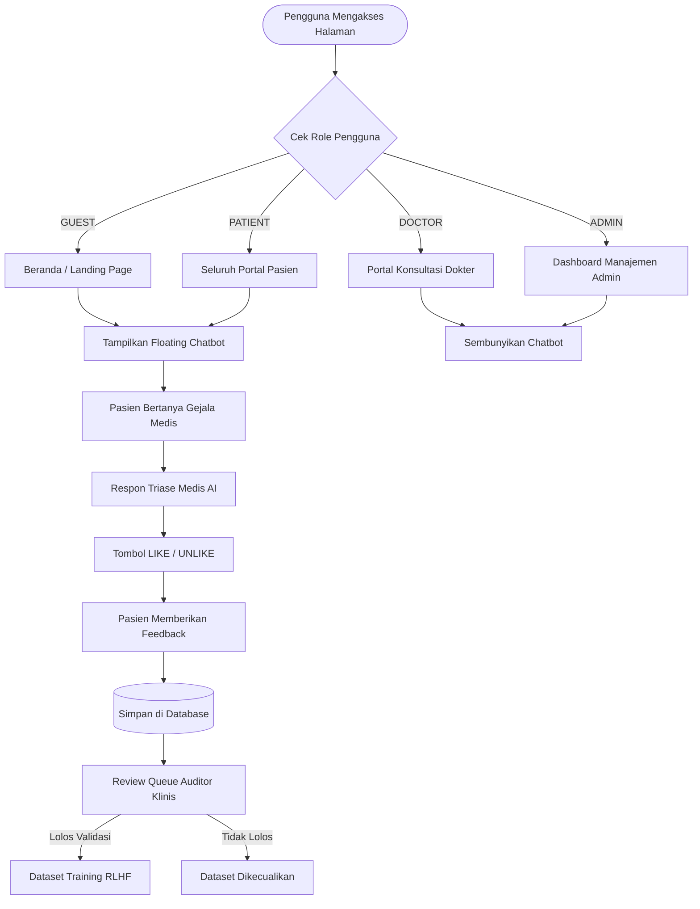

# 🏥 Zavora Life — All-in-One Healthcare & Agentic Insurance Platform

> **Mobile-First Healthcare Platform** powered by **Next.js PWA**, **NestJS**, **Neon PostgreSQL**, **Autra-AI Agentic Policies**, **Leaflet Computational Geometry**, and **Nginx Load Balancer**.

---

## 👥 Executive Engineering Leadership Team

* 🎖️ **Chief Technology Officer (CTO)**: **Daffa Reivan Faturahman**
* ⚙️ **Infrastructure Engineer**: **Chandra Wijaya**
* 🌐 **Developer Relations Advocate (DevRel)**: **Swandaru Tirta Sandhika**

---

## 🏗️ System Architecture & Infrastructure



---

## 🤖 1. Autra-AI Agentic Claims Insurance Policies Engine

**Autra-AI** acts as an autonomous insurance verification agent integrated directly into the patient profile and claims workflow. It automatically correlates patient medical records, clinical resumes, and pharmacy invoices with insurer policy clauses.



### Format Dokumen Klaim PDF Resmi:
* **Kop Surat Resmi**: Zavora Life Healthcare System & Lisensi Kemenkes RI No. 881/YANKES/2024.
* **Kode Asuransi (Insurance Code)**: Kode unik polis terdaftar (`ZVR-CORP-88912-ID`, `ADM-HLTH-99412-JKT`, `FLR-2026-77890-INA`).
* **Identitas Pasien**: Nama Lengkap, NIK, No Rekam Medis (`RM-2026-008912`), Golongan Darah.
* **Resume Klinis & Dokter Penanggung Jawab**: dr. Andi Setiawan, Sp.PD (SIP: 503/442-Dinkes/2024).
* **Kode Diagnosis ICD-10**: Validasi diagnosa primer & sekunder terstandarisasi.
* **Rincian Biaya Medis & Obat**: Breakdown konsultasi, laboratorium, dan e-resep farmasi.
* **Cap Digital & QR Code Autra-AI**: QR verification dan kode pre-auth valid.

---

## 🧭 2. Facilities Routing & Computational Geometry (Big-O Architecture)

Modul fasilitas kesehatan (`/facilities`) menggunakan algoritma geometri komputasi dan optimasi rute lalu lintas di belakang layar (*background system*) tanpa membebani antarmuka pengguna:



### Analisis Kompleksitas Komputasi (Big-O Complexity):
| Tahapan | Algoritma | Kompleksitas Waktu | Kompleksitas Ruang | Catatan Implementasi |
|---|---|---|---|---|
| **Prescan Wilayah** | Spatial Bounding Box | $\mathcal{O}(\log N + K)$ | $\mathcal{O}(K)$ | Mengeliminasi $90\%$ faskes di luar radius $\pm 0.15^\circ$ sebelum perhitungan bola bumi. |
| **Kalkulasi Jarak** | Haversine Formula | $\mathcal{O}(K)$ | $\mathcal{O}(1)$ | Menggunakan radius bumi $R = 6371\text{ km}$ dengan akurasi hingga level meter. |
| **Pengurutan Faskes**| Dual-Pivot Quicksort | $\mathcal{O}(K \log K)$ | $\mathcal{O}(\log K)$ | Mengurutkan faskes terdekat, rating tertinggi, atau alfabetis. |
| **Rute Tercepat** | Dijkstra (Min-Heap) | $\mathcal{O}((V + E) \log V)$ | $\mathcal{O}(V)$ | Mengutamakan jalan berkecepatan tinggi & menghindari titik kemacetan padat. |
| **Rute Terpendek** | A* Heuristic Search | $\mathcal{O}(b^d) \sim \mathcal{O}(E)$ | $\mathcal{O}(V)$ | Menggunakan fungsi heuristik jarak Euclidean terarah menuju faskes tujuan. |

### Visualisasi Jalur Lalu Lintas Multi-Warna:
* 🔵 **Garis Biru (`#2563eb`)**: **Jalan Lancar** (arus stabil ~45 km/jam).
* 🟡 **Garis Kuning (`#eab308`)**: **Ramai Lancar** (arus padat sedang ~25 km/jam).
* 🔴 **Garis Merah (`#ef4444`)**: **Macet / Padat** (titik persimpangan atau mendekati IGD faskes ~10 km/jam).
* **Interactive Live Legend**: Terpasang di pojok kanan bawah peta Leaflet (`🔵 Lancar • 🟡 Ramai Lancar • 🔴 Macet`).

---

## 💬 3. Chatbot Visibility Guard & RLHF Review Pipeline

Sistem chatbot Zavora Life menerapkan pembatasan tampilan berbasis peran pengguna (*Role-Based Visibility*) dan siklus peninjauan umpan balik model (*RLHF Feedback Queue*):



---

## 📂 4. Dataset Directory Architecture

```text
SEHAT-KUAT/
├── datasets/
│   └── facilities/
│       └── faskes_master_indonesia.csv      # Dataset Master Rumah Sakit, Puskesmas, Apotek 24J & Lab
├── ai-service/
│   └── datasets/
│       ├── chatbot/                         # Kumpulan percakapan triase medis
│       ├── medical_analysis/                # Skrining laboratorium & analisis radiologi
│       ├── feedback_rlhf/
│       │   └── ai_feedback_training_sample.csv # Dataset feedback LIKE/UNLIKE untuk fine-tuning model
│       └── rag_kb/
│           └── medical_rag_kb.csv           # Pedoman klinis ICD-10, triase darurat & pedoman PERKI/IDAI
```

---

## 🔐 5. Security & Authentication Methods

### 1. Password Hashing (Argon2id)
* **Algoritma**: `Argon2id` (v=19)
* **Parameter**: `timeCost: 3`, `memoryCost: 65536 KB (64 MB)`, `parallelism: 4`
* **Proteksi**: Kebal terhadap serangan ASIC/GPU cracking dan side-channel attacks.

### 2. Session & Auth Architecture
* **Tokens**: JWT bertanda tangan HMAC-SHA256.
* **Transport**: Disimpan dalam `HttpOnly`, `SameSite=Strict`, `Secure` cookies.
* **Role Registration Policy**: Form pendaftaran publik (`/register`) khusus untuk **PATIENT**. Akun **DOCTOR** dan **ADMIN** dibuat secara internal oleh sistem.

### 3. Concurrency-Safe Queue & Atomic Booking
* **Transaction Engine**: Dijalankan di dalam `prisma.$transaction`.
* **Locking Strategy**: Mengisolasi evaluasi jadwal dan nomor antrean berurutan (`MAX(queueNumber) + 1`) per dokter per hari untuk mencegah *race condition* dan *double-booking*.

---

## 🚀 Panduan Menjalankan Aplikasi

### 1. Inisialisasi Database Neon PostgreSQL
```powershell
# Generate Prisma Client
npm run prisma:generate

# Sinkronisasi Skema Database
npm run prisma:push

# Masukkan Data Seed (Admin, Dokter, Pasien, Faskes)
npm run prisma:seed
```

### 2. Menjalankan Server Pengembangan
```powershell
# Terminal 1 - Backend NestJS API (:4000)
npm run dev:api

# Terminal 2 - Frontend Next.js PWA (:3000)
npm run dev:web
```

### 3. Menjalankan Build Produksi
```powershell
npm run build
```

---

## 🔒 Security & Code Audit Summary

| Layer | Audit Check | Status | Verification Detail |
|---|---|---|---|
| **Auth** | Password Hashing | ✅ PASSED | Argon2id dengan 64MB memory cost |
| **Auth** | Session Security | ✅ PASSED | HttpOnly, Secure, SameSite=Strict cookies |
| **Database** | SQL Injection | ✅ PASSED | Parameterized queries via Prisma ORM |
| **Insurance** | Autra-AI Pre-Auth | ✅ PASSED | Real-time policy limit & ICD-10 validation |
| **Facilities** | Computational Geometry | ✅ PASSED | Spatial prescan O(log N + K) & Dijkstra traffic routing |
| **Frontend** | Type Safety | ✅ PASSED | 0 TypeScript errors across NestJS & Next.js builds |
| **Export** | PDF Claim Generator | ✅ PASSED | A4 print stylesheet dengan QR & cap digital resmi |

---

## 📄 Lisensi
Hak Cipta © 2026 **Zavora Life Engineering Team**. All rights reserved.
