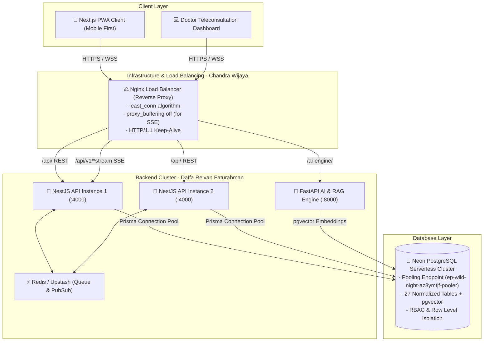

# 🏥 KlinikSehat — Production Healthcare Platform

> **Mobile-First Healthcare Platform** powered by **Next.js PWA**, **NestJS**, **Neon PostgreSQL**, **OpenRouter AI**, and **Nginx Load Balancer**.

---

## 👥 Executive Engineering Leadership Team

* 🎖️ **Chief Technology Officer (CTO)**: **Daffa Reivan Faturahman**
* ⚙️ **Infrastructure Engineer**: **Chandra Wijaya**
* 🌐 **Developer Relations Advocate (DevRel)**: **Swandaru Tirta Sandhika**

---

## 🏗️ System Architecture & Infrastructure



---

## 🔐 Security Algorithms & Core Engineering Methods

### 1. Password Hashing (Argon2id)
* **Algorithm**: `Argon2id` (v=19)
* **Parameters**: `timeCost: 3`, `memoryCost: 65536 KB (64 MB)`, `parallelism: 4`
* **Protection**: Resistant to GPU/ASIC cracking and side-channel timing attacks.
* **Storage**: Cryptographically salted hash strings stored in the Neon PostgreSQL `users` table.

### 2. Session & Auth Architecture
* **Tokens**: JSON Web Tokens (JWT) signed with HMAC-SHA256.
* **Transport**: Set as `HttpOnly`, `SameSite=Strict`, `Secure` cookies to prevent XSS credential theft.
* **Geolocation Security**: Mandatory GPS coordinate consent flow (`PUT /api/v1/users/location`) immediately following user registration and login.

### 3. Concurrency-Safe Queue & Atomic Booking Algorithm
* **Transaction Engine**: Managed inside `prisma.$transaction`.
* **Locking Strategy**: Evaluates schedule overlaps and assigns sequential queue numbers (`MAX(queueNumber) + 1`) per doctor per calendar day within an isolated database transaction to eliminate race conditions and double-booking.

### 4. Server-Sent Events (SSE) Real-Time Streaming
* **Mechanism**: HTTP/1.1 persistent streaming powered by RxJS `Observable` and NestJS `@Sse()`.
* **Endpoints**:
  * `/api/v1/queues/stream/:doctorId`: Real-time queue ticket ticker.
  * `/api/v1/notifications/stream/:userId`: Instant push alerts without polling.
  * `/api/v1/ai/consultation/stream`: Token-by-token streaming AI responses from OpenRouter.

### 5. Idempotent Webhook Processing
* **Endpoint**: `POST /api/v1/webhooks/payment`
* **Protection**: Transaction reference validation prevents double-processing on network retries. Automatically reconciles appointment statuses and pushes SSE notifications.

### 6. N+1 Query Prevention for Data Tables
* **Relational Prefetching**: Uses eager-batching queries in Prisma with single-roundtrip joins.
* **Indexes**: Neon PostgreSQL indexes on `userId`, `doctorId`, `patientId`, `specialization`, and `appointmentDate` ensure $O(\log N)$ fast pagination.

---

## 📂 Project Structure

```text
SEHAT-KUAT/
├── apps/
│   ├── api/                       # NestJS API Backend (:4000)
│   │   ├── src/
│   │   │   ├── auth/              # Argon2id Authentication & RBAC
│   │   │   ├── users/             # User Management & Geolocation Sync
│   │   │   ├── patients/          # Patient Profiles & Medical Data
│   │   │   ├── doctors/           # Doctor Directory & Schedules
│   │   │   ├── clinics/           # Clinic Branches
│   │   │   ├── appointments/      # Atomic Booking & Scheduling
│   │   │   ├── queues/            # Live Queue & SSE Streams
│   │   │   ├── consultations/     # EMR & Clinical Teleconsultation
│   │   │   ├── medical-records/   # ICD-10 Diagnoses & Records
│   │   │   ├── prescriptions/     # Digital E-Prescriptions
│   │   │   ├── payments/          # Payment Reconciliations
│   │   │   ├── notifications/     # Notification System
│   │   │   ├── webhooks/          # Secure Webhooks Gateway
│   │   │   ├── common/            # Interceptors, Filters & Events
│   │   │   └── ai/                # AI Consultation & Telemetry
│   │   └── package.json
│   └── web/                       # Next.js 16 PWA Frontend (:3000)
│       ├── src/
│       │   ├── app/               # App Router Pages (/doctors, /chat, /doctor/consultations/[id], etc.)
│       │   ├── hooks/             # SSE Streaming Hooks (useQueueStream, useNotificationStream)
│       │   ├── lib/api/           # Centralized API SDK Client
│       │   └── stores/            # Zustand State Stores
│       └── package.json
├── prisma/
│   ├── schema.prisma              # 27 Normalized PostgreSQL Models
│   └── seed.ts                    # Safe Development Seeding Script
├── docker/
│   └── nginx.conf                 # Nginx Load Balancer with SSE Buffering Disabled
├── services/
│   └── ai/                        # FastAPI AI Service
├── docker-compose.yml             # Full-Stack Orchestration
└── .env.example                   # Environment Template
```

---

## 🚀 Step-by-Step Running Guide

### 1. Inisialisasi Lingkungan (.env)
Pastikan file `.env` di root terkonfigurasi dengan URL database Neon PostgreSQL:
```bash
cp .env.example .env
```

### 2. Sinkronisasi Database Neon & Seeding Data
Jalankan perintah berikut langsung dari root direktori:
```powershell
# 1. Generate Prisma Client
npm run prisma:generate

# 2. Sinkronisasi Skema ke Neon PostgreSQL
npm run prisma:push

# 3. Masukkan Data Seed Contoh (Admin, Dokter, Pasien, Jadwal)
npm run prisma:seed
```

### 3. Menjalankan Server Pengembangan (Development Mode)
Buka 2 jendela terminal di folder root:

* **Terminal 1 — Backend NestJS API (`http://localhost:4000`):**
  ```powershell
  npm run dev:api
  ```

* **Terminal 2 — Frontend Next.js PWA (`http://localhost:3000`):**
  ```powershell
  npm run dev:web
  ```

### 4. Build Production
Untuk memvalidasi dan mengompilasi seluruh aplikasi:
```powershell
npm run build
```

---

## 🛠️ Troubleshooting & Port Management

### Mengatasi "Another next dev server is already running / Port 3000 is in use"
Jika Next.js mendeteksi proses server lain yang sedang berjalan di port 3000/3001/3002:

* **Matikan proses Next.js yang berjalan di background (Windows PowerShell):**
  ```powershell
  # Cari dan matikan proses node yang memegang port
  Get-Process -Name node | Stop-Process -Force
  ```
  *Atau gunakan perintah Taskkill jika PID diketahui:*
  ```powershell
  taskkill /PID <PID_NUMBER> /F
  ```
* **Jalankan ulang frontend:**
  ```powershell
  npm run dev:web
  ```

---

## 🔒 Security & Code Audit Summary

| Layer | Audit Check | Status | Verification Detail |
|---|---|---|---|
| **Auth** | Password Hashing | ✅ PASSED | Argon2id with 64MB memory cost |
| **Auth** | Session Hijacking | ✅ PASSED | HttpOnly, Secure, SameSite=Strict cookies |
| **Database** | SQL Injection | ✅ PASSED | Parameterized queries via Prisma ORM |
| **Database** | Data Isolation | ✅ PASSED | Tenant role-based isolation on all medical records |
| **API** | Error Masking | ✅ PASSED | Global HttpExceptionFilter hides raw database traces |
| **API** | Input Validation | ✅ PASSED | Strict DTO validation with class-validator |
| **Realtime** | SSE Buffering | ✅ PASSED | Nginx `proxy_buffering off` configured for event streams |
| **Frontend** | Type Safety | ✅ PASSED | 0 TypeScript errors across NestJS and Next.js builds |

---

## 📄 License
UNLICENSED — Proprietary & Confidential to **KlinikSehat Team**.
